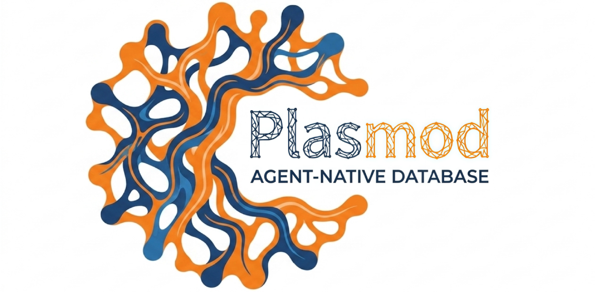

<div align="center">
  
</div>

<div align="center">

[English](README.md) · [中文](README.zh-CN.md)

</div>

<div align="center">

[](https://go.dev/)
[](https://www.python.org/)
[](https://www.docker.com/)
[](LICENSE)

</div>

# Plasmod

**Plasmod** is an open-source **agent-native database** for AI applications and multi-agent systems. It provides cognitive object storage, event-driven memory lifecycle, and structured evidence retrieval — purpose-built for agent memory workloads.

## What is Plasmod?

Plasmod is a database designed for AI agents that treats **memory**, **state**, **event**, **artifact**, and **relation** as first-class database objects — not just vectors or chunks.

**Core design principles:**

- **Event-driven architecture** — All state changes flow through an append-only WAL, enabling replay, audit, and provenance tracking
- **Canonical object model** — Agent, Session, Memory, State, Artifact, Edge are native database types with lifecycle management
- **Structured evidence retrieval** — Query results return evidence packages with provenance, not just top-k similarity matches
- **Workspace / Session isolation** — Built-in multi-tenant support for agent-level and session-level data boundaries

## Why Plasmod?

Most agent memory solutions today are built on top of general-purpose infrastructure:

| Approach | Limitation |
|----------|------------|
| Vector DB + metadata tables | No native event/state model, no provenance |
| Chunk store for RAG | Retrieval only, no structured evidence |
| Application-level event log | Disconnected from retrieval execution |
| Graph layer | Separate from vector search, no unified query |

**Plasmod is designed from the ground up for agent memory:**

- Event-centric state evolution (not direct overwrite)
- Memory lifecycle management (active → compressed → archived → deleted)
- Provenance-preserving evidence return
- Multi-agent / multi-session memory workflow

## Key Features

| Feature | Description |
|---------|-------------|
| **Agent-native data model** | Event, Memory, State, Artifact, Edge as first-class objects |
| **HTTP API** | Endpoints for ingest, query, admin, and canonical CRUD |
| **Structured evidence** | Query responses include provenance and proof traces |
| **Workspace isolation** | Built-in `workspace_id` and `session_id` scoping |
| **Tiered data plane** | Hot (in-memory) → Warm (segment index) → Cold (S3) |
| **Python SDK** | `pyplasmod` published on PyPI |
| **LangChain integration** | `PlasmodVectorStore` adapter (experimental) |
| **Docker deployment** | Single-command local stack |

## Quick Start

### 1. Start Plasmod Server

```bash
git clone https://github.com/CodeSoul-co/Plasmod.git
cd Plasmod
docker compose up -d
```

### 2. Verify the Server

```bash
curl http://127.0.0.1:8080/healthz
```

A successful response indicates that the server is running.

### 3. Install Python SDK

```bash
pip install pyplasmod
```

Or install a specific version:

```bash
pip install pyplasmod==0.1.0
```

### 4. Verify SDK Installation

```bash
python -c "import pyplasmod; print(pyplasmod.__version__)"
```

Expected output:

```text
0.1.0
```

### 5. Connect with SDK

```python
from pyplasmod import EasyPlasmod

with EasyPlasmod(base_url="http://127.0.0.1:8080") as p:
    print(p.health())
```

### Ingest and Query

Use the Plasmod HTTP API as the source of truth for ingest and query schemas.

**Ingest an event:**

```bash
curl -X POST http://127.0.0.1:8080/v1/ingest/events \
  -H "Content-Type: application/json" \
  -d '{
    "event_type": "observation",
    "workspace_id": "demo",
    "payload": {
      "text": "Plasmod is an agent-native database."
    }
  }'
```

**Query:**

```bash
curl -X POST http://127.0.0.1:8080/v1/query \
  -H "Content-Type: application/json" \
  -d '{
    "query_text": "agent database",
    "workspace_id": "demo",
    "top_k": 5
  }'
```

For the latest request schemas, see:

- [docs/api/ingest.md](docs/api/ingest.md)
- [docs/api/query.md](docs/api/query.md)

## Python SDK

`pyplasmod` is published on PyPI.

```bash
pip install pyplasmod
```

Basic connection example:

```python
from pyplasmod import EasyPlasmod

with EasyPlasmod() as p:
    print(p.health())
```

For SDK documentation, see [pyplasmod repository](https://github.com/CodeSoul-co/pyplasmod).

## LangChain Integration

> **Note:** LangChain adapter is experimental. API may change.

```bash
pip install "pyplasmod[langchain]"
```

```python
from pyplasmod.langchain import PlasmodVectorStore
```

See [pyplasmod repository](https://github.com/CodeSoul-co/pyplasmod) for latest working examples.

## HTTP API Overview

| Group | Endpoints |
|-------|-----------|
| **Health** | `GET /healthz` |
| **Core** | `POST /v1/ingest/events` · `POST /v1/query` |
| **Admin** | `/v1/admin/*` |
| **Canonical CRUD** | `/v1/agents` · `/v1/sessions` · `/v1/memory` · `/v1/states` · `/v1/artifacts` · `/v1/edges` |

Full API documentation: [docs/api/overview.md](docs/api/overview.md)

## Documentation

| Document | Description |
|----------|-------------|
| [API Overview](docs/api/overview.md) | HTTP API reference |
| [Ingest API](docs/api/ingest.md) | Event ingestion |
| [Query API](docs/api/query.md) | Query request/response |
| [Admin API](docs/api/admin.md) | Admin operations |
| [Architecture](docs/architecture/) | System design |
| [中文文档](README.zh-CN.md) | Chinese documentation |
| [Python SDK](https://github.com/CodeSoul-co/pyplasmod) | pyplasmod |

## Roadmap

### Current

- Plasmod server with HTTP APIs
- Docker Compose local deployment
- Event ingest and query API foundation
- Canonical object model foundation
- Python SDK published as `pyplasmod` v0.1.0
- LangChain adapter foundation

### Experimental / In Progress

- SDK ingest/query alignment with latest server APIs
- Hot / warm / cold retrieval improvements
- Provenance-rich query responses
- Multi-agent / session isolation enforcement
- Additional embedding providers

### Planned

- Helm Chart / Kubernetes deployment
- Offline deployment guide
- Monitoring guide
- Policy-aware retrieval
- Richer graph reasoning
- Multi-language SDKs

## Contributing

See [docs/contributing.md](docs/contributing.md) for contribution guidelines.

## License

Plasmod is licensed under the [MIT License](LICENSE).

---

<div align="center">

**[Documentation](docs/)** · **[Python SDK](https://github.com/CodeSoul-co/pyplasmod)** · **[Issues](https://github.com/CodeSoul-co/Plasmod/issues)**

</div>