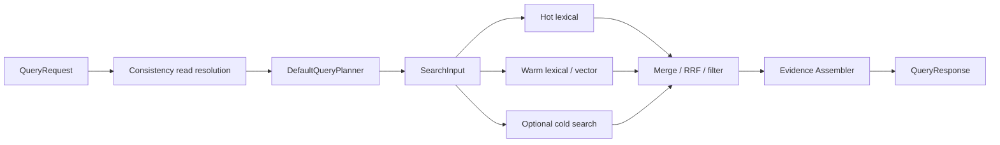

# 查询路径设计

## 请求解析

`QueryRequest` 支持 query text、scope、agent/session/tenant/workspace、top K、time window、object/memory/edge types、target IDs、dataset/source/batch selector、access/materialization/runtime selector、query ops、warm segment、cold tier 和 precomputed embedding。

## 可见性等待

`ExecuteQueryContext` 先按 read mode 调用 consistency controller。strict/bounded 可等待相应 watermark；eventual 不承诺立即看到最后一次写入。

## 精确 selector fast path

`target_object_ids`、state/latest 等结构化 selector 可以从 canonical store 补充或直接获取对象 ID，避免纯语义搜索。返回的 `query_status` 区分真正 retrieval seed 与 canonical supplement。

## Tiered retrieval

hot index 先执行 lexical search；不足 top K 时查询 warm plane。warm 可合并 lexical 和 dense/sparse candidates。`include_cold=true` 才访问 cold store，并在结果中记录 tier、mode、candidate count 与 fallback。

## Evidence assembly

Assembler 按 object/memory type 过滤 IDs，合并 evidence cache，读取 incident edges 与 versions，添加 policy/tier/segment/proof steps，并生成 provenance。

## 返回边界

默认 response 是结构化 evidence。`objects_only` 仅减少响应语义，不改变 source of truth。`APP_MODE=prod` 会移除 debug/raw/chain trace 等字段，因此调用方不能依赖测试模式的 debug payload。
