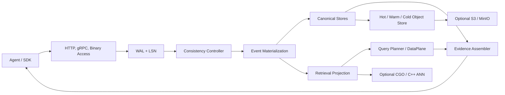

# 系统架构

## 启动组装

`src/cmd/server/main.go` 调用 `app.BuildServer()`，后者依次构造 clock/bus/WAL、RuntimeStorage、cold store、semantic layer、materialization/evidence、embedding/retrieval plane、node manager、coordinator hub、Runtime、consistency controller、Gateway 和 transport server。`app.RunServers()` 根据 listen mode 启动一个或两个 HTTP listener，并可启动 gRPC listener。

## Access plane

`access.Gateway` 注册 management 和 API routes。unified mode 共用一个 mux；split mode 将 health/admin 放在 management port，将 SDK/data/internal routes 放在 API port。`WrapAdminAuth` 仅保护 `/v1/admin/*`，`WrapVisibility` 根据 `APP_MODE` 清理或附加 debug 信息。

## Event 与 consistency plane

disk storage 选择 `FileWAL`，memory storage 选择 `InMemoryWAL`。`consistency.Controller` 在 WAL append 后按 mode 进行同步或队列 projection，并通过 `Tracker` 管理 accepted/visible LSN、deadline 和 checkpoint。

## Canonical plane

`storage.RuntimeStorage` 聚合 object、edge、version、policy、contract、audit、algorithm state、segment 和 index stores。Badger backend 将对象/edge/version 放在同一个 DB 中，以 transaction 提交 `CanonicalProjection`。

## Retrieval plane

`TieredDataPlane` 将 hot lexical、warm lexical/vector 和显式 cold search 合并。C++ bridge 存在时可使用 HNSW/条件 IVF/DiskANN；无 `retrieval` build tag 时 stub 返回 unavailable，Go 路径应降级到 lexical。

## Evidence plane

`evidence.Assembler` 对 retrieval candidates 进行 object type 过滤、cache fragment 合并、1-hop edge expansion、version lookup、policy annotation 和 provenance 组装。

## 不在当前启动主链中的代码

`coordinator/controlplane/`、`eventbackbone/streamplane/` 和 `platformpkg/` 包含大规模上游兼容代码。当前核心启动主要使用 `coordinator/` 顶层的 lightweight Hub；不得将上游目录的存在解释为完整控制面已运行。
