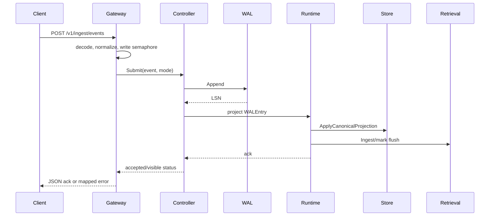

# 写入路径设计

## 1. Access admission

Gateway 用 `PLASMOD_MAX_CONCURRENT_WRITES` 控制非阻塞 semaphore；占满时 HTTP 返回 503。gRPC service 通过相同 Gateway service method 进入同一 admission。

## 2. Consistency resolution

Event `access.consistency` 优先于 runtime default。bounded 模式读取 `freshness_sla_ms`，否则使用 `PLASMOD_CONSISTENCY_BOUNDED_MAX_LAG`。

## 3. WAL acceptance

Controller 在锁保护下 append，获得 LSN，并将 canonical mode/lag 写回 Event 以便恢复。FileWAL 负责持久化和 scan error propagation。

## 4. Projection

strict 在请求路径中等待 projection；bounded 使用按 shard reservation 的 queue；eventual 使用异步 queue。projector 调用 Runtime 的事件处理，写 canonical projection、retrieval record、evidence fragment 和派生日志。

## 5. Visibility

成功 projection 后 Tracker 标记 LSN visible、推进 watermark 并保存 checkpoint。checkpoint 可按 flush interval 合并持久化，避免每次 visibility 都 fsync。

## 6. 二级异步处理

EventSubscriber 扫描不超过 visible watermark 的 WAL entry，触发 memory extraction、consolidation、reflection、graph、tool trace 等 worker；panic 进入 dead-letter channel/overflow buffer。

## ACK 语义

客户端必须区分：请求未接受、WAL 已接受但暂不可见、canonical visible、retrieval projection pending。`AcceptedNotVisibleError` 表示 Event 已有 LSN，重试时不能简单创建新 event ID。
