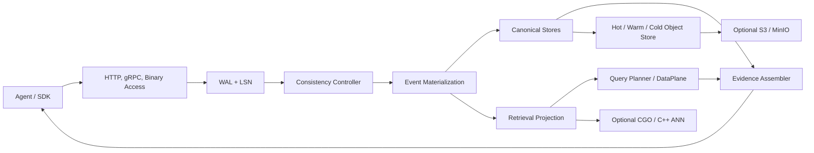
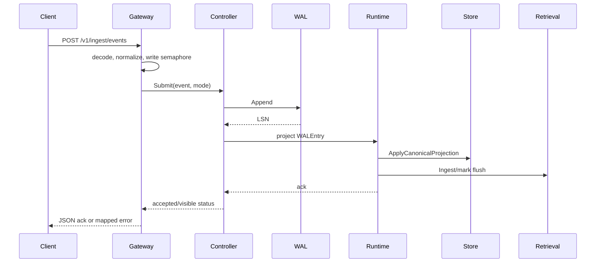

# 02. 整体系统架构与设计原则

> Language: 中文 | [English](en/02-system-architecture-and-design.md)

---

从静态结构与运行依赖说明 Layer、Subsystem、Module 和 Canonical Object 的归属。

---

## 02.1. Static System Architecture

### 02.1.1. 定位

| 项 | 结论 |
|---|---|
| 类型 | Architecture |
| 设计目标 | 说明 active Plasmod 进程由哪些 layer、subsystem、module 和 canonical object 构成 |
| 关键路径 | 是，覆盖 bootstrap、读写、存储和后台维护 |
| 当前成熟度 | 部分：核心单进程组合完整；统一分布式 control plane 不是 active 默认路径 |

### 02.1.2. 代码入口

| 入口 | 代码 |
|---|---|
| Process main | `src/cmd/server/main.go` |
| Composition root | `src/internal/app/bootstrap.go: BuildServer` |
| HTTP boundary | `src/internal/access/gateway.go` |
| Runtime | `src/internal/worker/runtime.go`, `runtime_consistency.go` |
| Shared schemas | `src/internal/schemas/` |
| Shutdown | `ServerBundle.Shutdown`, `app.RunServers` |

### 02.1.3. Layer 与模块

| Layer | Active packages/modules | 性质 | Runtime/Bootstrap ownership |
|---|---|---|---|
| Interface | `access.Gateway`, gRPC server, `transport.Server`, SDK | 独立协议边界 | Bootstrap 构造 server；Gateway 持有 Runtime/store |
| Runtime & Control | `worker.Runtime`, consistency Controller, `nodes.Manager`, active `coordinator.Hub`, Orchestrator | concrete service + registry | Runtime 持有核心依赖；Orchestrator 单独注册 |
| Event & Causality | WAL, Bus, clock/watermark, derivation/policy decision log, subscriber | interface + concrete implementation | Runtime/Controller/Subscriber 持有 |
| Canonical Object | schemas, materialization service/workers, graph/version/policy records | type + derivation logic | Runtime 调 materializer；workers 处理辅助对象 |
| Storage & Retrieval | RuntimeStorage, Badger/memory stores, TieredObjectStore, TieredDataPlane, native bridge | replaceable interfaces + adapters | Bootstrap 按 env 选择 |
| Cross-cutting | policy, evidence, metrics, consistency, auth/visibility, algorithm plugins | shared services | Runtime/Gateway/worker 持有 |
| Shared Object Model | Event, Agent, Session, Memory, State, Artifact, Edge, Version, Policy, ShareContract | low-level schema contract | 被所有层引用，不持有行为 |

### 02.1.4. 内部组成与依赖方向

```text
cmd/server
  -> app
     -> access / grpc / transport
     -> worker Runtime / consistency / nodes
     -> coordinator Hub
     -> semantic / materialization / evidence
     -> dataplane -> retrievalplane -> C++ bridge
     -> storage -> schemas
     -> eventbackbone -> schemas
```

`schemas` 位于低层；`app` 是唯一 composition root。Active package graph 未发现由 lower layer 反向 import Gateway 的循环。`transport.RuntimeAPI` 用最小 interface 避免 transport/worker import cycle。

### 02.1.5. 可替换边界

| Capability | Replacement interface | 当前选择点 |
|---|---|---|
| WAL | `eventbackbone.WAL` | storage mode/WAL persistence |
| Canonical stores | `storage.RuntimeStorage` 及子接口 | `storage.BuildRuntimeFromEnv` |
| Cold store | cold object contract | S3 env 是否完整 |
| Retrieval | `dataplane.DataPlane` | bootstrap constructor |
| Embedder | embedding generator interfaces | `PLASMOD_EMBEDDER` |
| Query planning | `semantic.QueryPlanner` | bootstrap constructor |
| Memory algorithm | `MemoryManagementAlgorithm` | algorithm config/profile |
| Worker | `nodes` interfaces/`Runnable` | NodeManager registration |

### 02.1.6. 数据与状态

| State class | Source of truth | Volatile derivatives |
|---|---|---|
| Event order | FileWAL/InMemoryWAL LSN | subscriber cursor, controller queues |
| Canonical objects | RuntimeStorage object/edge/version/policy/contract stores | Hot cache, Query nodes |
| Retrieval | disposable projection over canonical/Event | segment/native index handles |
| Evidence | Edge/Version/derivation/policy records | evidence cache and response proof trace |
| Algorithm | MemoryAlgorithmStateStore + Memory fields | plugin in-memory state |
| Scheduling | controller/tracker/checkpoint | queues, slots, counters |

完整字段见 [Object and Message Registry](14-implementation-status-gaps-and-claim-boundaries.md)。

### 02.1.7. 正确性

- 同一 Badger backend 内 canonical projection 可原子写 Event/object/edge/version；native index、S3 和 cache 不在该事务中。
- WAL + deterministic IDs 提供 replay 基础。
- consistency Controller 是写入可见性真实 gate。
- 上游/兼容目录不因存在大量代码而自动成为 active architecture。

### 02.1.8. 声明边界

可声明：Plasmod 是 Event、canonical object graph、retrieval projection、evidence 和 tiered storage 组合的单进程 agent-native data runtime。

不可声明：默认进程已完整启用 imported distributed controlplane/streamplane，或所有 layer 都是独立部署服务。

### 02.1.9. 缺口

| Gap | Required work |
|---|---|
| logical layer 和 deployable subsystem 混用 | 明确 service/process boundary 后再拆分 |
| Orchestrator 未接主请求路径 | 决定整合或移除 active claim |
| distributed ownership 未形成 | 增加 leader/shard/task lifecycle contract 与运行测试 |
| 部分 object type 注册但持久/查询能力有限 | 补 storage/API/materialization contract tests |

---

## 02.2. 设计总览

### 02.2.1. 核心抽象

Plasmod 将 runtime 事实分为三层：

- **Causal input**：Event + WAL/LSN。
- **Canonical state**：Memory、AgentState、Artifact、Edge、ObjectVersion、Policy、ShareContract。
- **Derived access path**：hot/warm/cold cache、lexical/vector/sparse index 与 evidence cache。

Event 是“为什么发生”的因果输入，canonical store 是“当前对象是什么”的权威事实，retrieval projection 是“如何快速找到”的派生视图。三者不能混为一个向量表。

### 02.2.2. 四个工程 plane

| Plane | 责任 | 主要代码 |
|---|---|---|
| Access | HTTP/gRPC/binary、验证、backpressure、admin boundary | `internal/access`, `internal/api/grpc`, `internal/transport` |
| Event/Consistency | WAL、LSN、admission、queue、watermark、checkpoint、replay | `internal/eventbackbone`, `worker/consistency` |
| Canonical/Coordination | object materialization、storage、version、policy、worker dispatch | `materialization`, `storage`, `coordinator`, `worker` |
| Retrieval/Evidence | planner、tiered search、native bridge、graph/version/proof assembly | `semantic`, `dataplane`, `evidence`, `cpp` |

### 02.2.3. 同步与异步边界

- Gateway 的 write semaphore 是同步 admission。
- WAL Append 在所有 consistency mode 下先发生。
- strict projection 在写请求内等待；bounded/eventual 使用 controller queue 和 worker。
- retrieval index flush 可在 background loop 中发生；canonical visibility 与最终 index shape 不应被混为一项状态。
- EventSubscriber 只消费 controller 已推进的 visible LSN，并触发二级 worker chain。

### 02.2.4. 设计限制

- direct canonical CRUD 并非全部 Event-first。
- access/policy 不是完整 IAM。
- runtime 为单进程组装；上游 control/stream code 不代表完整集群已启用。
- native retrieval 与 embedding provider 是条件依赖。

---

## 02.3. 设计原则

### 02.3.1. Event first

状态改变优先表达为 Event，并通过 WAL 获得 LSN。新增核心写功能应接入 `Runtime.SubmitIngestContext`，除非它被明确标记为管理或兼容路径。

### 02.3.2. Canonical object as source of truth

Memory、State、Artifact、Edge 和 Version 的 canonical store 决定对象事实。索引可以丢弃重建，canonical data 不应依赖某个 ANN 文件才能解释。

### 02.3.3. Retrieval as projection

lexical、dense、sparse、hot/warm/cold index 是查询加速层。embedding family/dimension 必须与 segment metadata 一致，变更时进行受控 reindex。

### 02.3.4. Evidence as query-stage primitive

查询返回的不只是 object IDs；edge、version、provenance、proof trace 和 applied filters 是 response contract 的组成部分。

### 02.3.5. Explicit version and lifecycle

对象更新必须有稳定 ID、版本与生命周期；logical delete、archive 和 hard purge 语义分开。

### 02.3.6. Policy as infrastructure

PolicyRecord、ShareContract 和 AuditRecord 属于存储与查询基础设施，但不伪装为完整 IAM。

### 02.3.7. Pluggable algorithms

Memory algorithm 通过 dispatcher 和 AlgorithmStateStore 扩展，不改写 canonical storage contract。

### 02.3.8. Extensible schema and hooks

Dynamic Event v0.4 为 actor、access、materialization、retrieval 和 hooks 留出扩展点；扩展必须保持旧输入兼容和 replay 可解释性。

---

## 02.4. 扩展模型

Plasmod 的扩展应保持 Event -> canonical -> retrieval -> evidence -> replay 的完整闭环。

| 扩展点 | Contract/Registry | 注册位置 |
|---|---|---|
| Event/object schema | `schemas.Event`, canonical types | schema + materializer + storage |
| Query operator | `semantic.QueryPlanner`, QueryRequest fields | planner/runtime query path |
| Worker | `worker/nodes` interfaces | `BuildServer` node manager wiring |
| Storage backend | `storage.RuntimeStorage` 子接口 | `storage.factory` |
| Retrieval backend | `dataplane.DataPlane` / retrievalplane | bootstrap/tiered plane |
| Memory algorithm | cognitive algorithm/dispatcher | bootstrap + AlgorithmStateStore |
| Policy/evidence hook | EventHooks/PolicyEngine/Assembler | materialization/query stage |
| Transport | Gateway service methods | HTTP/gRPC/binary adapter |

新增实现必须说明持久化、并发、错误、配置、replay、delete/purge、API/SDK 和 compatibility。详细步骤见 [Extensibility](13-extensibility-compatibility-and-evolution.md)。

---

## 02.5. Source of Truth 模型

| 数据 | Source of Truth | Derived View | 恢复方式 |
|---|---|---|---|
| 接受顺序 | WAL + LSN | bus/subscriber stream | 从 checkpoint 后扫描 WAL |
| Event 内容 | ObjectStore Event + WAL entry | stream/debug view | replay/scan |
| Memory | Canonical ObjectStore | hot cache、lexical/vector/sparse index、cold copy | canonical rebuild/reindex |
| AgentState | Canonical ObjectStore | state selector/query result | Event replay；注意 worker lookup state |
| Artifact | Canonical ObjectStore | retrieval projection/cold copy | Event replay |
| Edge | GraphEdgeStore | evidence subgraph | canonical projection/replay |
| Version | SnapshotVersionStore | latest/historical response | canonical projection/replay |
| Policy/Contract | PolicyStore/ContractStore | policy filter/trace annotation | store backup/replay where applicable |
| Algorithm State | MemoryAlgorithmStateStore | lifecycle/recall response | store backup/algorithm rebuild |
| Retrieval Segment | canonical memory + segment metadata | native/lexical index | reindex |

### 02.5.1. 两层权威事实

Event/WAL 是因果和恢复顺序的权威来源；canonical store 是在线对象读写的权威来源。两者通过 LSN、mutation event 和 version 关联。只保留 index 无法恢复完整对象语义；只保留 canonical store 可能恢复对象，但无法证明原始接受顺序。

### 02.5.2. 不变量

- watermark 只能推进到成功 projection 的 LSN。
- retrieval hit 不得创造不存在的 canonical object 事实。
- index family/dimension 与当前 embedder 不兼容时必须阻止错误复用或显式 reindex。
- cold copy 是归档层，不自动取代 WAL/Badger backup。

---

## 02.6. 系统架构

本页提供快速架构总览。严格区分 Architecture、Chain、Perspective、Mechanism、Engine，并核对每项字段、API、typed I/O、调用关系、状态和完成度时，使用 [System Design Reference](14-implementation-status-gaps-and-claim-boundaries.md)。



### 02.6.1. 启动组装

`src/cmd/server/main.go` 调用 `app.BuildServer()`，后者依次构造 clock/bus/WAL、RuntimeStorage、cold store、semantic layer、materialization/evidence、embedding/retrieval plane、node manager、coordinator hub、Runtime、consistency controller、Gateway 和 transport server。`app.RunServers()` 根据 listen mode 启动一个或两个 HTTP listener，并可启动 gRPC listener。

### 02.6.2. Access plane

`access.Gateway` 注册 management 和 API routes。unified mode 共用一个 mux；split mode 将 health/admin 放在 management port，将 SDK/data/internal routes 放在 API port。`WrapAdminAuth` 仅保护 `/v1/admin/*`，`WrapVisibility` 根据 `APP_MODE` 清理或附加 debug 信息。

### 02.6.3. Event 与 consistency plane

disk storage 选择 `FileWAL`，memory storage 选择 `InMemoryWAL`。`consistency.Controller` 在 WAL append 后按 mode 进行同步或队列 projection，并通过 `Tracker` 管理 accepted/visible LSN、deadline 和 checkpoint。

### 02.6.4. Canonical plane

`storage.RuntimeStorage` 聚合 object、edge、version、policy、contract、audit、algorithm state、segment 和 index stores。Badger backend 将对象/edge/version 放在同一个 DB 中，以 transaction 提交 `CanonicalProjection`。

### 02.6.5. Retrieval plane

`TieredDataPlane` 将 hot lexical、warm lexical/vector 和显式 cold search 合并。C++ bridge 存在时可使用 HNSW/条件 IVF/DiskANN；无 `retrieval` build tag 时 stub 返回 unavailable，Go 路径应降级到 lexical。

### 02.6.6. Evidence plane

`evidence.Assembler` 对 retrieval candidates 进行 object type 过滤、cache fragment 合并、1-hop edge expansion、version lookup、policy annotation 和 provenance 组装。

### 02.6.7. 不在当前启动主链中的代码

`coordinator/controlplane/`、`eventbackbone/streamplane/` 和 `platformpkg/` 包含大规模上游兼容代码。当前核心启动主要使用 `coordinator/` 顶层的 lightweight Hub；不得将上游目录的存在解释为完整控制面已运行。

---

## 02.7. 写入路径设计



### 02.7.1. Access admission

Gateway 用 `PLASMOD_MAX_CONCURRENT_WRITES` 控制非阻塞 semaphore；占满时 HTTP 返回 503。gRPC service 通过相同 Gateway service method 进入同一 admission。

### 02.7.2. Consistency resolution

Event `access.consistency` 优先于 runtime default。bounded 模式读取 `freshness_sla_ms`，否则使用 `PLASMOD_CONSISTENCY_BOUNDED_MAX_LAG`。

### 02.7.3. WAL acceptance

Controller 在锁保护下 append，获得 LSN，并将 canonical mode/lag 写回 Event 以便恢复。FileWAL 负责持久化和 scan error propagation。

### 02.7.4. Projection

strict 在请求路径中等待 projection；bounded 使用按 shard reservation 的 queue；eventual 使用异步 queue。projector 调用 Runtime 的事件处理，写 canonical projection、retrieval record、evidence fragment 和派生日志。

### 02.7.5. Visibility

成功 projection 后 Tracker 标记 LSN visible、推进 watermark 并保存 checkpoint。checkpoint 可按 flush interval 合并持久化，避免每次 visibility 都 fsync。

### 02.7.6. 二级异步处理

EventSubscriber 扫描不超过 visible watermark 的 WAL entry，触发 memory extraction、consolidation、reflection、graph、tool trace 等 worker；panic 进入 dead-letter channel/overflow buffer。

### 02.7.7. ACK 语义

客户端必须区分：请求未接受、WAL 已接受但暂不可见、主 projection 已完成且 LSN visible、subscriber/flush 等二级维护仍 pending。当前主 visibility callback 同时要求 canonical commit 与 retrieval ingest 成功，不对外承诺“canonical visible 但 retrieval pending”的独立成功状态。`AcceptedNotVisibleError` 表示 Event 已有 LSN，重试时应复用同一 event identity，而不是盲目创建新 event ID。
