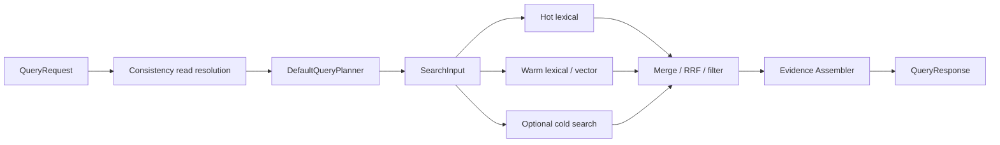

# 06. 检索、查询与证据构建

> Language: 中文 | [English](en/06-retrieval-query-and-evidence.md)

---

说明双平面数据、候选检索、排序、hydrate、图扩展、版本、provenance 和 proof trace。

---

## 06.1. Canonical State vs Retrieval Projection

### 06.1.1. 定位

| 项 | 结论 |
|---|---|
| 类型 | Data Perspective |
| 问题 | 权威状态与检索加速视图为何分离、如何连接和恢复 |
| 成熟度 | 完整的基本双平面，自动 divergence reconciliation 部分 |

### 06.1.2. 代码入口

| Direction / concern | Package / file | Interface / method |
|---|---|---|
| canonical contracts | `src/internal/storage/contracts.go` | `ObjectStore`, `GraphEdgeStore`, `SnapshotVersionStore`, `RuntimeStorage` |
| canonical commit | `src/internal/storage/canonical_projection.go`, Badger stores | `ApplyCanonicalProjection` |
| event derivation | `src/internal/materialization/service.go` | `MaterializeEvent` |
| projection write/read | `src/internal/dataplane/contracts.go` | `DataPlane.Ingest`, `Search`, `Flush` |
| vector projection | `src/internal/dataplane/vectorstore.go` | `AddText(s)`, `AddVector`, `Build`, `Search` |
| tier connection | `src/internal/storage/tiered.go`, `src/internal/dataplane/tiered_adapter.go` | tier read/write and `IncludeCold` search |
| rebuild | `src/internal/worker/runtime.go`, access admin handlers, index workers | `ReindexEmbeddings`, prebuild and replay methods |

### 06.1.3. 输入与输出

| Flow | Input | Output | Connection key |
|---|---|---|---|
| canonical mutation | canonical object/edge/version bundle | persisted object graph | object ID + version |
| projection mutation | `IngestRecord` | lexical/vector/sparse/native record | `ObjectID` |
| query projection | `SearchInput` | candidate object IDs and scores | `ObjectID` |
| hydration | candidate IDs + requested types | canonical GraphNode/object/version/policy | typed object ID |
| rebuild | canonical Memory list or WAL entries | regenerated projection/index | object ID + embedding family/dim |
| delete/archive | object ID + mode | tombstone/eviction/cold movement | same object ID across tiers |

### 06.1.4. 内部组成

| Canonical plane | Projection plane |
|---|---|
| Event/WAL, Memory, State, Artifact | lexical records, vector/sparse records |
| Edge, ObjectVersion | hot/warm/cold segment metadata |
| PolicyRecord, ShareContract, Audit | native index handles and candidate views |
| MemoryAlgorithmState | evidence fragment cache |

Object ID 是主要连接键；namespace、object/memory type、event time、embedding family/dim 是检索兼容 metadata。

转换与 hydration：

| Direction | Function/path |
|---|---|
| Event -> both planes | `MaterializeEvent` produces Memory + `IngestRecord` |
| canonical -> projection rebuild | `Runtime.ReindexEmbeddings`, warm prebuild/index workers |
| projection -> canonical | candidate IDs -> ObjectStore/Edge/Version lookups |
| cold -> response | explicit `include_cold`, then merge/filter/evidence |

### 06.1.5. 调用关系

Event write 由 consistency projection callback 驱动 materializer、DataPlane 和 canonical store；query 先读 projection，再从 canonical stores hydrate 并构造 evidence。Admin replay/reindex 从 WAL 或 canonical state 重建 projection。

当前主写回调先执行 `ApplyCanonicalProjection`，再执行 `DataPlane.Ingest`，两者仍不共享跨引擎 transaction。Event、Memory、stable State、可选 Artifact、Edge 和 Version 在 canonical transaction 内提交；retrieval 成功后才推进 visible watermark。canonical 已提交但 retrieval 失败时，query access gate 以 `MutationLSN > ReadWatermarkLSN` 拒绝该对象，并由同一 WAL LSN 重试补全 projection。

### 06.1.6. 数据与状态

Projection 中存 text/vector/sparse terms、attributes、segment/tier/index metadata，不应当成为完整 policy/provenance/version 真值。Canonical store 中保存对象语义，不保证每个对象都已进入 ANN index。

| Plane | Persistent state | In-memory state |
|---|---|---|
| canonical | Badger objects/edges/versions/policies/audit/algorithm state | memory backend equivalents |
| projection | segment/index metadata、可选 native/cold vector state | lexical postings、buffers、hot cache |
| connection metadata | object ID、embedding family/dim、generation/segment refs | query trace/cache entries |

### 06.1.7. 正确性

- Runtime canonical commit precedes retrieval projection；两者无跨引擎 transaction，watermark 是 query visibility fence。
- Candidate ID 在 hydration 前必须存在于 canonical/tiered object plane 并通过 `CanonicalAccess`；projection-only ID 仅限显式 vector-only/warm-segment 路径。
- Evidence graph expansion 后再次检查 node/edge endpoint/proof/provenance，避免可见 seed 泄漏不可见引用。
- inactive warm Memory 会从普通 query filter 中移除；explicit cold result 可保留 archived object。
- delete/purge 要分别清理 canonical、segment/index、cache、cold records。
- archive/export 必须在删除 warm 前确认 cold write；当前由操作路径而非统一 invariant manager 执行。

#### 06.1.7.1. Recovery model

Canonical plane 是恢复依据，WAL 是重新派生依据；projection 可通过 replay/reindex 重建。当前无持续 divergence scanner/checksum checkpoint，因此“可重建”不等于“自动发现并修复所有漂移”。

### 06.1.8. 声明边界

可声明 authoritative canonical state + disposable retrieval acceleration view。

不可声明 projection 与 canonical 始终同步、共享 ACID transaction，或任意 projection hit 都已有完整 canonical/evidence 数据。

### 06.1.9. 缺口

- 缺少 projection generation/checkpoint 与 per-object projection status；
- 缺少持续 stale/divergence scanner 和 checksum；
- 缺少统一 deletion/archive/reactivation tombstone propagation；
- 缺少 projection write 失败后的自动 canonical-driven repair；
- 需要 dual-plane fault-injection、rebuild equivalence 和 stale-read contract tests。

---

## 06.2. Evidence Construction Pipeline

### 06.2.1. 定位

| 项 | 结论 |
|---|---|
| 类型 | Pipeline Perspective |
| 问题 | Retrieval hit 如何变成可解释、可追溯 response |
| 成熟度 | 完整基础 pipeline；completeness/confidence 与强治理部分缺失 |

### 06.2.2. 代码入口

| Concern | Package / file | Constructor / method |
|---|---|---|
| query entry | `src/internal/access/gateway.go`, `src/internal/worker/runtime.go` | query handler, `Runtime.ExecuteQuery` |
| query plan | `src/internal/semantic/` | `NewDefaultQueryPlanner`, `QueryPlanner.Build` |
| retrieval | `src/internal/dataplane/` | `DataPlane.Search` |
| evidence skeleton | `src/internal/evidence/assembler.go` | `NewAssembler`/`NewCachedAssembler`, `Build` |
| graph/proof completion | `src/internal/worker/chain/chain.go` | `QueryChain.Execute` |
| graph worker | `src/internal/worker/indexing/subgraph.go` | `Expand` |
| proof worker | `src/internal/worker/coordination/` | proof trace constructor/dispatch |

### 06.2.3. 输入与输出

| Stage | Typed input | Output |
|---|---|---|
| planning | `schemas.QueryRequest` | `schemas.QueryPlan` |
| candidate search | `dataplane.SearchInput` | `dataplane.SearchOutput` |
| assembly | candidate IDs + query context | nodes, incident edges, latest versions, provenance, policy annotations |
| graph expansion | `GraphExpandRequest` + hydrated nodes/edges | `GraphExpandResponse` |
| proof | seeds + subgraph | `[]ProofStep` |
| packaging | retrieval/evidence/consistency metadata | `schemas.QueryResponse` |

### 06.2.4. 内部组成

#### 06.2.4.1. Stage to function map

| Stage | Function/component | Output |
|---|---|---|
| Candidate retrieval | `DataPlane.Search` | object IDs/tier/segment trace |
| Type/memory filter | Runtime + `Assembler.filterByObjectTypes` | filtered IDs |
| Object hydration | Runtime/QueryChain ObjectStore lookups | GraphNode/type/provenance data |
| Graph expansion | `GraphEdgeStore.BulkEdges`, Subgraph worker | typed Edge/subgraph |
| Version resolution | `Assembler.resolveVersions` | latest ObjectVersion |
| Provenance integration | `resolveProvenance`, embedding attachment, derivation worker | event/ref strings |
| Policy annotation | policy filters + `governanceAnnotations` | applied filters/proof steps |
| Proof construction | assembler skeleton/cache + ProofTraceWorker BFS | ProofStep list |
| Packaging | `QueryResponse` | evidence-bearing response |

#### 06.2.4.2. Evidence schema

| Record | Key fields |
|---|---|
| GraphNode | object ID/type/label/properties |
| Edge | source/type/relation/destination/weight/provenance/time |
| ObjectVersion | object/version/mutation event/valid interval/tag |
| ProofStep | step/depth/source/edge/target/weight/operation/description |
| EvidenceSubgraph | seeds/nodes/edges/proof/provenance |

#### 06.2.4.3. Cache behavior

Ingest `PreComputeService` 可将 EvidenceFragment 放入 bounded in-memory cache。Query hit 合并 fragment；miss 时仍读取 Edge/Version/Policy 构建 delta evidence。Cache 不持久，版本变化后没有统一 invalidation generation，正确性必须依赖 canonical lookup 而非 cache-only answer。

### 06.2.5. 调用关系

Gateway 解析 QueryRequest，Runtime 执行 consistency read gate 和 plan，NodeManager/DataPlane 获取 candidates；Runtime 做类型/作用域/状态过滤及 canonical supplement；Assembler hydrate canonical data；QueryChain 再扩展 subgraph 并生成 proof；visibility middleware 最后可能剥离 debug/chain 字段。

`/v1/query/batch` 是 warm vector batch direct path，不接受一组完整 `QueryRequest`，也不执行本 evidence pipeline。它不能作为 Query & Evidence Chain 的等价批量接口。

### 06.2.6. 数据与状态

- 输入 projection state：candidate IDs、score、tier/segment/index trace；
- canonical state：Memory/State/Artifact/Event、Edge、ObjectVersion、PolicyRecord；
- provenance state：source Event/ref、derivation log、embedding annotation；
- in-memory state：bounded evidence fragment cache 和 query-local hydrated graph；
- 输出状态：`QueryResponse` 中 objects、subgraph、proof、retrieval/consistency metadata；query 本身通常不修改 canonical state。

Graph/version/provenance rules：

- Assembler 读取 returned IDs 的 incident edges；QueryChain 默认 one-hop subgraph + proof worker 最多内部 cap 8 hop。
- Version resolution 当前选择 latest；Query time-window 不等于 historical version resolution。
- Provenance 来自 Edge ref、Version mutation Event、Memory/State/Artifact source fields 和 embedding annotations。
- supporting/contradicting/derived relation 能以 EdgeType 表达，但没有统一 evidence rank/confidence formula。

### 06.2.7. 正确性

Cache miss 仍回读 canonical stores；因此 cache 是优化而非权威。当前 version resolver 选择 latest，不提供 query-time historical snapshot；graph expansion 和 proof 有 hop/node/edge cap。Policy annotation 不保证每个 object/edge 已经过统一 deny/mask enforcement，必须与 Runtime 过滤路径一并审查。

Policy and proof boundary：

Policy annotation 说明对象状态；它不总是强制删除对象。Proof trace 是可解释执行/关系轨迹，不是形式验证证明。Production visibility middleware 还可能删除 debug/chain fields。

### 06.2.8. 声明边界

可声明结构化 nodes/edges/versions/provenance/proof package 和 cache-assisted assembly。

不可声明 evidence completeness 已计算、proof 可完整 replay、policy annotation 等价 enforcement、confidence/support score 有统一统计含义。

### 06.2.9. 缺口

- 缺少 version-aware cache generation/invalidation；
- 缺少 historical/valid-at version resolver；
- `schemas.GraphExpander` 的两参数接口没有 active implementation，实际 worker 使用三参数 `SubgraphExecutorWorker.Expand`；
- 缺少统一 evidence ranker、completeness/confidence 定义；
- 缺少 policy-safe graph traversal 和 edge-level visibility enforcement；
- 缺少 full pipeline replayability 与 stale-cache contract tests。

---

## 06.3. Dual-plane Data Mechanism

### 06.3.1. 定位

| 项 | 结论 |
|---|---|
| 类型 | Mechanism |
| 目标 | canonical truth 与 disposable retrieval acceleration 分离 |
| 关键路径 | ingest/query/recovery |
| 成熟度 | 完整基础机制，持续 reconciliation 部分 |

### 06.3.2. Code entry

`materialization.MaterializationResult` 同时输出 canonical records 与 `dataplane.IngestRecord`；Runtime 把它们分别交给 DataPlane 和 RuntimeStorage；Query 先取 candidate IDs 再回连 stores/evidence。

### 06.3.3. Input/output

| Transform | Input | Output |
|---|---|---|
| canonicalization | Event | Event/Memory/checkpoint State/可选 Artifact/Edge/Version |
| projection | Event/Memory text+embedding+metadata | IngestRecord/segments/index |
| hydration | candidate IDs | object-derived nodes/edges/versions/provenance |
| rebuild | canonical Memory scan | fresh retrieval plane |

### 06.3.4. Internal components

Canonical：WAL, RuntimeStorage, Badger/memory stores。Projection：Hot index, SegmentDataPlane, Vector/Sparse stores, native bridge, cold index, evidence cache。

### 06.3.5. Call relation

Ingest writes projection before canonical commit；query reads projection then canonical；admin reindex resets/re-ingests；delete/purge/archive coordinate multiple components manually。

### 06.3.6. State and synchronization

Connection key 是 object ID，compatibility key 是 embedding family + dimension。`flushDirty`/periodic flush 维护 warm native index；checkpoint tracks LSN visibility but not a full per-object projection generation。

### 06.3.7. Correctness

Canonical store is authority；projection may be dropped/rebuilt。However, DataPlane success before canonical failure can produce orphan candidate；canonical-only mutation can produce missing candidate。Current repair is replay/reindex/manual purge, not automatic scanner。

### 06.3.8. 声明边界

可声明 dual-plane architecture and rebuildable projection。

不可声明 synchronous equality at every instant, cross-plane ACID, automatic stale detection or zero-loss delete propagation。

### 06.3.9. 缺口

Add projection generation/object status, canonical commit token, tombstone propagation, checksum/divergence scan, repair plan and post-repair query verification。

---

## 06.4. Evidence Construction Mechanism

### 06.4.1. 定位

| 项 | 结论 |
|---|---|
| 类型 | Mechanism |
| 目标 | Candidate -> canonical object -> graph/version/provenance/policy -> proof package |
| 成熟度 | 完整基础，ranking/completeness 部分 |

### 06.4.2. Code entry and APIs

`Assembler.Build`, `QueryChain.Run`, ProofTraceWorker, SubgraphExecutorWorker, `GET /v1/traces/{id}`, `POST /v1/query`。

### 06.4.3. Input/output

Input：SearchInput/SearchOutput, policy filter descriptions, canonical stores。Output：QueryResponse objects/nodes/edges/versions/provenance/proof/cache/retrieval metadata。

### 06.4.4. Internal components

| Component | Function |
|---|---|
| fragment cache/precompute | amortize ingest-time evidence metadata |
| object hydrator logic | infer/load Memory/Event/Artifact/State data |
| edge expander | incident edges and one-hop subgraph |
| proof worker | BFS edge + derivation trace |
| version resolver | latest version |
| provenance resolver | source events/edge refs/mutation events |
| policy annotator | quarantine/retracted/filter proof steps |

### 06.4.5. Relations and version behavior

EdgeType can represent derived/support/conflict/share relationships；proof uses stored edges, not inferred missing edges。Version resolution is latest-only in current assembler；historical time-window does not select an exact historical snapshot。

### 06.4.6. Cache/state

Evidence cache is bounded in-memory and disposable；canonical evidence inputs live in Edge/Version/Policy/derivation stores。Cache hit/miss appears in response stats。

### 06.4.7. Correctness

- Duplicate edges are merged by EdgeID in QueryChain。
- Annotation is not always enforcement。
- Unknown ID type inference can default to memory。
- No formula for evidence completeness/confidence/support score。
- Proof trace can mix execution descriptions and graph derivation steps。

### 06.4.8. 声明边界

可声明 structured, traceable evidence assembly from canonical records。

不可声明 formal proof, complete provenance, calibrated confidence or version-time correctness for arbitrary historical queries。

### 06.4.9. 缺口

Need typed evidence node contract, policy-safe traversal, historical version resolver, cache generation/invalidation, rank/confidence/completeness definition and replay verifier。

---

## 06.5. Adaptive Retrieval Engine

### 06.5.1. 定位

| 项 | 结论 |
|---|---|
| 类型 | Engine |
| 原模块 | Retrieval Dataplane |
| 目标 | QueryPlan -> tiered/hybrid candidates with physical index acceleration |
| 关键路径 | 是 |
| 成熟度 | 完整基础 tiered/hybrid retrieval；intent/cost adaptation 部分 |

### 06.5.2. Code entry

| Item | Code |
|---|---|
| Go API | `src/internal/dataplane/contracts.go` |
| Active adapter | `tiered_adapter.go: TieredDataPlane` |
| Warm plane | `segment_adapter.go: SegmentDataPlane` |
| Logical index | `segmentstore/` |
| Vector/sparse | `vectorstore.go`, `sparsestore.go` |
| Native bridge | `dataplane/retrievalplane/bridge.go`, `cpp/retrieval` |
| Planner | `semantic.DefaultQueryPlanner` |
| Constructor | `NewTieredDataPlaneWithEmbedderAndConfig` |

### 06.5.3. Engine fields

| `TieredDataPlane` field | Meaning |
|---|---|
| `hot *segmentstore.Index` | fast in-memory lexical tier |
| `warm *SegmentDataPlane` | lexical/vector/sparse warm execution |
| `warmIngest func` | injectable/testable warm write path |
| `embedder` | configured embedding generator |
| cold lexical/vector/HNSW function fields | TieredObjectStore adapters |
| `rrfK` | fusion constant |

Warm plane internally owns segment index/planner/searcher/vector/sparse stores, embedder and registered warm segment mappings。

### 06.5.4. Interface and method surface

| Interface/API | Methods |
|---|---|
| `DataPlane` | `Ingest`, `Search`, `Flush` |
| Tiered extension | `BatchIngest`, reset/rebuild, hot/warm accessors |
| Warm segment | vector/flat ingest with index type, register/unload, text/vector search |
| Batch | plugin/raw/serial batch search and object-ID mapping |
| Native | index create/insert/search/release through bridge |

HTTP/transport mapping见 [API to Engine Matrix](14-implementation-status-gaps-and-claim-boundaries.md)。

### 06.5.5. Input/output

| Input | Fields used | Output |
|---|---|---|
| `IngestRecord` | ID/text/namespace/time/attributes/embedding/skip flag/family/dim | index/segment mutation |
| `SearchInput` | text/vector/TopK/namespace/time/types/cold | `SearchOutput` candidates/tier/trace/diagnostics |
| Warm batch | segment, NQ, TopK, flat vectors | IDs/distances/object ID rows |

### 06.5.6. Retrieval strategy

Hot lexical first；若不足 TopK 再查 warm；Cold only explicit。Warm can merge lexical and vector/sparse candidates via RRF/normalization。Precomputed query/event vectors bypass embedder。Native bridge unavailable时可退化到 lexical/Go path，具体能力取决于 build。

“adaptive” 当前主要是 tier fallback、candidate fusion、optional cold/native and early hot satisfaction；没有 general intent estimator、cost model 或 learned router。

### 06.5.7. Correctness and failure

- embedding family + dimension are compatibility boundaries；same dim is insufficient。
- `Search` returns value not error；backend failure classification is weak。
- object/memory type filters partly post-retrieval。
- native candidate does not carry canonical policy/evidence semantics。
- hot/warm writes happen together in TieredDataPlane, cold archive separate。

### 06.5.8. 声明边界

可声明 hybrid/tiered retrieval, optional native ANN, precomputed embeddings, RRF-style fusion and direct batch segment API。

不可声明 learned adaptive routing、all backends always enabled、ANN result equals final agent-visible answer or query plan executes every advanced operator type。

### 06.5.9. 缺口

Typed search error/partial result, score/reason metadata per candidate, policy-aware prefilter, intent/cost router, segment health/load feedback, cross-backend ranking contract and projection generation validation。

---

## 06.6. Evidence Assembly Engine

### 06.6.1. 定位

| 项 | 结论 |
|---|---|
| 类型 | Engine |
| 原模块 | Evidence Assembler |
| 目标 | Candidate IDs + query context -> structured evidence response |
| 关键路径 | structured `/v1/query` |
| 成熟度 | 完整基础 assembly；ranking/completeness/historical version 部分 |

### 06.6.2. Code entry

| Item | Code |
|---|---|
| Package | `src/internal/evidence` |
| Main files | `assembler.go`, `cache.go`, `fragment.go` |
| Constructors | `NewAssembler`, `NewCachedAssembler` |
| Wiring | `WithEdgeStore`, `WithVersionStore`, `WithObjectStore`, `WithPolicyStore` |
| Main method | `Build(SearchInput, SearchOutput, filters)` |
| Post assembly | `worker/chain.QueryChain`, Runtime embedding provenance |

### 06.6.3. Engine fields

| Field | Type | Purpose |
|---|---|---|
| `cache` | `*evidence.Cache` | ingest precomputed fragment lookup |
| `edgeStore` | `GraphEdgeStore` | one-hop incident edges |
| `versionStore` | `SnapshotVersionStore` | latest versions |
| `objectStore` | `ObjectStore` | type/memory subtype and source hydration |
| `policyStore` | `PolicyStore` | quarantine/retracted annotations |

### 06.6.4. Input/output fields

| Input | Used for |
|---|---|
| SearchInput object/memory types | post-filter |
| SearchOutput IDs/tier/cold/segments | response objects, proof steps, diagnostics |
| filters | `AppliedFilters` |
| stores/cache | edges/versions/provenance/policy/cache proof |

Output `QueryResponse` fields are enumerated in [Object and Message Registry](14-implementation-status-gaps-and-claim-boundaries.md)。

### 06.6.5. Internal components

| Suggested component | Actual function/status |
|---|---|
| Object Hydrator | prefix inference + store lookup，部分 |
| Graph Builder | `expandEdges` + QueryChain，完整基础 |
| Version Resolver | latest-only `resolveVersions` |
| Provenance Resolver | `resolveProvenance` + Runtime attachment |
| Policy Annotator | `governanceAnnotations`，annotation only |
| Proof Constructor | planner/retrieval/policy/response steps + fragments |
| Evidence Ranker | no independent ranker |
| Evidence Cache | bounded in-memory cache |
| Response Packager | QueryResponse construction |

### 06.6.6. Calls, sync and state

Runtime calls Assembler after retrieval/filter；then QueryChain augments nodes/edges/proof。All synchronous。Cache is mutable in-memory；Assembler itself has fixed dependency fields and no per-request state。

### 06.6.7. Correctness/failure

- Missing optional store yields empty corresponding section rather than error。
- Unknown ID defaults to memory type heuristic。
- Policy violation is annotated, not necessarily filtered。
- Latest version selection ignores historical query time。
- Cache miss is tolerated；cache staleness has no generation invalidation。

### 06.6.8. 声明边界

可声明 assembly of objects IDs, edges, latest versions, provenance and proof trace from canonical records。

不可声明 complete hydration, formal proof, calibrated evidence score, complete ACL enforcement or historical version correctness。

### 06.6.9. 缺口

Explicit `EvidencePackage` schema, typed hydrator, version-at-time resolver, policy decision enforcement, cache invalidation, rank/support/confidence/completeness algorithms and strict missing-dependency error mode。

---

## 06.7. 查询路径设计

### 06.7.1. 请求解析

`QueryRequest` 支持 query text、scope、agent/session/tenant/workspace、top K、time window、object/memory/edge types、target IDs、dataset/source/batch selector、access/materialization/runtime selector、query ops、warm segment、cold tier 和 precomputed embedding。

### 06.7.2. 可见性等待

`ExecuteQueryContext` 先按 read mode 调用 consistency controller。strict/bounded 可等待相应 watermark；eventual 不承诺立即看到最后一次写入。

### 06.7.3. 精确 selector fast path

`target_object_ids`、state/latest 等结构化 selector 可以从 canonical store 补充或直接获取对象 ID，避免纯语义搜索。返回的 `query_status` 区分真正 retrieval seed 与 canonical supplement。

### 06.7.4. Tiered retrieval

hot index 先执行 lexical search；不足 top K 时查询 warm plane。warm 可合并 lexical 和 dense/sparse candidates。`include_cold=true` 才访问 cold store，并在结果中记录 tier、mode、candidate count 与 fallback。

### 06.7.5. Evidence assembly

Assembler 按 object/memory type 过滤 IDs，合并 evidence cache，读取 incident edges 与 versions，添加 policy/tier/segment/proof steps，并生成 provenance。

### 06.7.6. 返回边界

默认 response 是结构化 evidence。`objects_only` 仅减少响应语义，不改变 source of truth。`APP_MODE=prod` 会移除 debug/raw/chain trace 等字段，因此调用方不能依赖测试模式的 debug payload。
