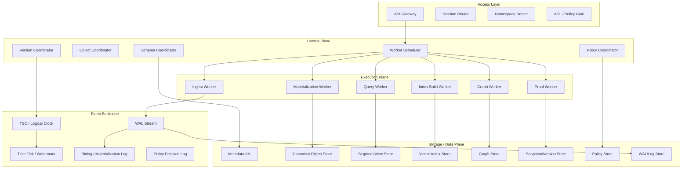
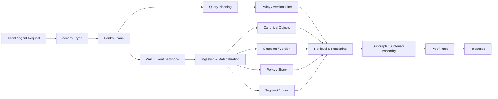

# Layered Design

## System Layer Diagram

```mermaid
flowchart TB
    subgraph L1["Access Layer"]
        A1["API Gateway"]
        A2["Session Router"]
        A3["Namespace Router"]
        A4["ACL / Policy Gate"]
    end

    subgraph L2["Control Plane"]
        B1["Schema Coordinator"]
        B2["Object Coordinator"]
        B3["Policy Coordinator"]
        B4["Version Coordinator"]
        B5["Worker Scheduler"]
    end

    subgraph L3["Execution Plane"]
        C1["Ingest Worker"]
        C2["Materialization Worker"]
        C3["Index Build Worker"]
        C4["Graph Worker"]
        C5["Query Worker"]
        C6["Proof Worker"]
    end

    subgraph L4["Storage / Data Plane"]
        D1["Metadata KV"]
        D2["Canonical Object Store"]
        D3["Segment/View Store"]
        D4["Vector Index Store"]
        D5["Graph Store"]
        D6["Snapshot/Version Store"]
        D7["Policy Store"]
        D8["WAL/Log Store"]
    end

    subgraph X["Event Backbone"]
        E1["TSO / Logical Clock"]
        E2["WAL Stream"]
        E3["Time Tick / Watermark"]
        E4["Binlog / Materialization Log"]
        E5["Policy Decision Log"]
    end

    A1 --> B5
    B5 --> C1
    B5 --> C2
    B5 --> C3
    B5 --> C4
    B5 --> C5
    B5 --> C6

    B4 --> E1
    E1 --> E3
    C1 --> E2
    E2 --> E4
    E2 --> D8

    C2 --> D2
    C3 --> D4
    C4 --> D5
    C5 --> D3
    C6 --> D6
    B3 --> D7
    B1 --> D1
```

## Data Flow Diagram

```mermaid
flowchart LR
    U["Client / Agent Request"] --> A["Access Layer"]
    A --> B["Control Plane"]

    B --> C["WAL / Event Backbone"]
    C --> D1["Ingestion & Materialization"]
    D1 --> E1["Canonical Objects"]
    D1 --> E2["Snapshot / Version"]
    D1 --> E3["Policy / Share"]
    D1 --> E4["Segment / Index"]

    B --> Q1["Query Planning"]
    Q1 --> Q2["Policy / Version Filter"]
    Q2 --> Q3["Retrieval & Reasoning"]
    E1 --> Q3
    E2 --> Q3
    E3 --> Q3
    E4 --> Q3

    Q3 --> Q4["Subgraph / Subtensor Assembly"]
    Q4 --> Q5["Proof Trace"]
    Q5 --> R["Response"]
```
