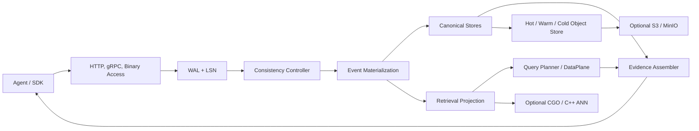
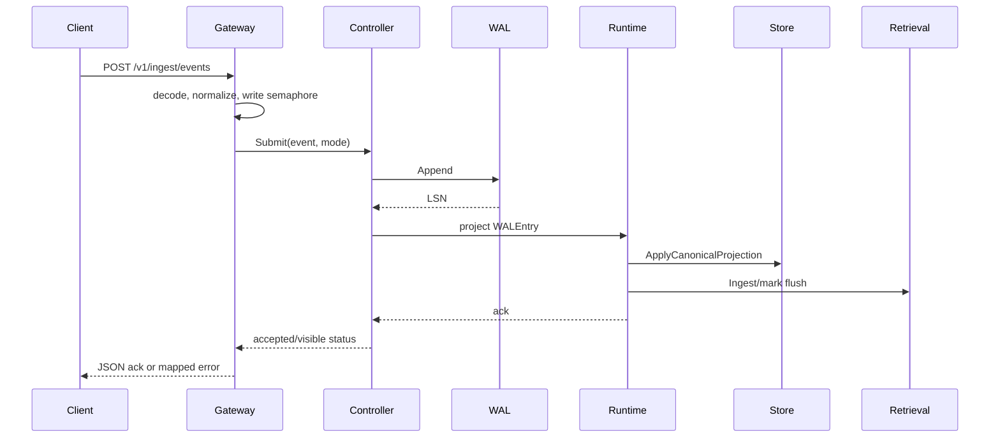

# 02. System Architecture and Design Principles

> Language: [中文](../02-system-architecture-and-design.md) | English

---

This chapter describes the active Plasmod process in terms of layers, subsystems, modules, canonical objects, dependency direction, and runtime ownership.

---

## 02.1. Static System Architecture

### 02.1.1. Positioning

| Attribute | Definition |
|---|---|
| Type | Architecture |
| Design goals | Explain which layers, subsystems, modules and canonical objects make up the active Plasmod process |
| Critical path | Yes. Covers bootstrap, reads, writes, storage, and background maintenance. |
| Current maturity | Partial: the core single-process composition is complete; the unified distributed control plane is not on the active default path. |

### 02.1.2. Code Entry Points

| Entry Point | Code |
|---|---|
| Process main | `src/cmd/server/main.go` |
| Composition root | `src/internal/app/bootstrap.go: BuildServer` |
| HTTP boundary | `src/internal/access/gateway.go` |
| Runtime | `src/internal/worker/runtime.go`, `runtime_consistency.go` |
| Shared schemas | `src/internal/schemas/` |
| Shutdown | `ServerBundle.Shutdown`, `app.RunServers` |

### 02.1.3. Layers and Modules

| Layer | Active packages/modules | Nature | Runtime/Bootstrap ownership |
|---|---|---|---|
| Interface | `access.Gateway`, gRPC server, `transport.Server`, SDK | Independent protocol boundary | Bootstrap constructs the servers; Gateway holds Runtime/store references |
| Runtime & Control | `worker.Runtime`, consistency Controller, `nodes.Manager`, active `coordinator.Hub`, Orchestrator | Concrete services and registries | Runtime holds core dependencies; Orchestrator is registered separately. |
| Event & Causality | WAL, Bus, clock/watermark, derivation and policy-decision logs, subscriber | Interfaces plus concrete implementations | Held by Runtime, Controller, and Subscriber. |
| Canonical Object | schemas, materialization service/workers, graph/version/policy records | Types plus derivation logic | Runtime invokes materializers; workers handle auxiliary objects. |
| Storage & Retrieval | RuntimeStorage, Badger/in-memory stores, TieredObjectStore, TieredDataPlane, native bridge | Replaceable interfaces and adapters | Bootstrap selects implementations from environment configuration. |
| Cross-cutting | policy, evidence, metrics, consistency, authentication/visibility, algorithm plugins | Shared services | Held by Runtime, Gateway, and workers. |
| Shared Object Model | Event, Agent, Session, Memory, State, Artifact, Edge, Version, Policy, ShareContract | Low-level schema contract | Referenced across layers; does not own behavior. |

### 02.1.4. Internal Components and Dependency Direction

```text
cmd/server
  -> app
     -> access / grpc / transport
     -> worker Runtime / consistency / nodes
     -> coordinator Hub
     -> semantic / materialization / evidence
     -> dataplane -> retrievalplane -> C++ bridge
     -> storage -> schemas
     -> eventbackbone -> schemas
```

`schemas` is a low-level package and `app` is the composition root. The active package graph does not contain a lower-layer reverse import of Gateway. `transport.RuntimeAPI` uses a narrow interface to avoid a transport/worker import cycle.

### 02.1.5. Replaceable Boundaries

| Capability | Replacement interface | Currently selected |
|---|---|---|
| WAL | `eventbackbone.WAL` | storage mode/WAL persistence |
| Canonical stores | `storage.RuntimeStorage` and sub-interfaces | `storage.BuildRuntimeFromEnv` |
| Cold store | cold object contract | selected when the required S3 environment is complete |
| Retrieval | `dataplane.DataPlane` | bootstrap constructor |
| Embedder | embedding generator interfaces | `PLASMOD_EMBEDDER` |
| Query planning | `semantic.QueryPlanner` | bootstrap constructor |
| Memory algorithm | `MemoryManagementAlgorithm` | algorithm config/profile |
| Worker | `nodes` interfaces/`Runnable` | NodeManager registration |

### 02.1.6. Data and State

| State class | Source of truth | Volatile derivatives |
|---|---|---|
| Event order | FileWAL/InMemoryWAL LSN | subscriber cursor, controller queues |
| Canonical objects | RuntimeStorage object/edge/version/policy/contract stores | Hot cache, Query nodes |
| Retrieval | disposable projection over canonical/Event | segment/native index handles |
| Evidence | Edge/Version/derivation/policy records | evidence cache and response proof trace |
| Algorithm | MemoryAlgorithmStateStore + Memory fields | plugin in-memory state |
| Scheduling | controller/tracker/checkpoint | queues, slots, counters |

See [Object and Message Registry](14-implementation-status-gaps-and-claim-boundaries.md) for complete field definitions.

### 02.1.7. Correctness

- Within one Badger backend, a canonical projection can atomically write Event/object/edge/version records; the native index, S3, and caches are outside that transaction.
- WAL + deterministic IDs provide the basis for replay.
- The consistency controller is the authoritative gate for write visibility.
- Upstream/compatibility directories do not automatically become active architectures due to the presence of large amounts of code.

### 02.1.8. Claim Boundaries

Plasmod is a single-process agent-native data runtime that combines Event, canonical object graph, retrieval projection, evidence and tiered storage.

Do not claim that the default process fully activates the imported distributed control plane or stream plane, or that each logical layer is an independently deployable service.

### 02.1.9. Gaps

| Gap | Required work |
|---|---|
| Logical layers and deployable subsystems are conflated | Define service/process boundaries before splitting deployment units. |
| Orchestrator is not on the primary request path | Integrate it into that path or remove the active-system claim |
| Distributed ownership is incomplete | Add leader, shard, and task-lifecycle contracts with runtime tests. |
| Some object types are registered but have limited persistence or query coverage | Add storage, API, and materialization contract tests. |

---

## 02.2. Design Overview

### 02.2.1. Core Abstractions

Plasmod divides runtime into three levels:

- **Causal input**: Event + WAL/LSN.
- **Canonical state**: Memory, AgentState, Artifact, Edge, ObjectVersion, Policy, ShareContract.
- **Derived access paths**: hot/warm/cold caches, lexical/vector/sparse indexes, and the evidence cache.

Events explain why a change occurred, canonical stores define the authoritative current objects, and retrieval projections make those objects fast to find. These roles must not be collapsed into a single vector table.

### 02.2.2. Four Engineering Planes

| Plane | Responsibility | Key code |
|---|---|---|
| Access | HTTP/gRPC/binary, validation, backpressure, and the admin boundary | `internal/access`, `internal/api/grpc`, `internal/transport` |
| Event/Consistency | WAL, LSN, admission, queue, watermark, checkpoint, replay | `internal/eventbackbone`, `worker/consistency` |
| Canonical/Coordination | object materialization, storage, version, policy, worker dispatch | `materialization`, `storage`, `coordinator`, `worker` |
| Retrieval/Evidence | planner, tiered search, native bridge, graph/version/proof assembly | `semantic`, `dataplane`, `evidence`, `cpp` |

### 02.2.3. Synchronous and Asynchronous Boundaries

- Gateway's write semaphore is synchronous admission.
- The WAL Append occurs first in all consistency modes.
- Strict mode waits for projection in the write request. Bounded and eventual modes use controller queues and workers.
- Retrieval index flush can occur in the background loop; canonical visibility should not be confused with final index shape.
- EventSubscriber consumes only the controller's advanced visible LSN and triggers a secondary worker chain.

### 02.2.4. Design Constraints

- The direct canonical CRUD is not entirely Event-first.
- Access/policy is not a complete IAM.
- Runtime is assembled for a single process; upstream control/stream code does not represent that the entire cluster is enabled.
- Native retrieval and embedding providers are conditional.

---

## 02.3. Design Principles

### 02.3.1. Event first

State changes should be represented as Events and assigned an LSN through the WAL. New core write paths should use `Runtime.SubmitIngestContext` unless explicitly classified as management or compatibility operations.

### 02.3.2. Canonical object as source of truth

The canonical store of Memory, State, Artifact, Edge, and Version determines the facts of the object. Indices can be discarded for reconstruction, and canonical data should not depend on an ANN file to be interpreted.

### 02.3.3. Retrieval as projection

Lexical, dense, sparse, and hot/warm/cold indexes are query-acceleration structures. The embedding family and dimension must match segment metadata; incompatible changes require a controlled reindex.

### 02.3.4. Evidence as query-stage primitive

Query responses include more than object IDs. Edges, versions, provenance, proof steps, and applied filters are part of the response contract.

### 02.3.5. Explicit version and lifecycle

Object updates require stable IDs, versions, and lifecycle state. Logical deletion, archival, and hard purge have distinct semantics.

### 02.3.6. Policy as infrastructure

PolicyRecord, ShareContract, and AuditRecord are part of the storage and query infrastructure, but they do not constitute a full identity and access management system.

### 02.3.7. Pluggable algorithms

Memory algorithms are extended through the dispatcher and AlgorithmStateStore without changing the canonical storage contract.

### 02.3.8. Extensible schema and hooks

Dynamic Event v0.4 defines extension points for actors, access, materialization, retrieval, and hooks. Extensions must preserve legacy-input compatibility and replay explainability.

---

## 02.4. Extension Model

A Plasmod extension should preserve the complete Event -> canonical -> retrieval -> evidence -> replay loop.

| Extension Point | Contract/Registry | Registration Location |
|---|---|---|
| Event/object schema | `schemas.Event`, canonical types | schema + materializer + storage |
| Query operator | `semantic.QueryPlanner`, QueryRequest fields | planner/runtime query path |
| Worker | `worker/nodes` interfaces | `BuildServer` node manager wiring |
| Storage backend | `storage.RuntimeStorage` sub-interfaces | `storage.factory` |
| Retrieval backend | `dataplane.DataPlane` / retrievalplane | bootstrap/tiered plane |
| Memory algorithm | cognitive algorithm/dispatcher | bootstrap + AlgorithmStateStore |
| Policy/evidence hook | EventHooks/PolicyEngine/Assembler | materialization/query stage |
| Transport | Gateway service methods | HTTP/gRPC/binary adapter |

New implementations must define persistence, concurrency, errors, configuration, replay, delete/purge behavior, API/SDK exposure, and compatibility. See [Extensibility](13-extensibility-compatibility-and-evolution.md).

---

## 02.5. Source-of-Truth Model

| Data | Source of Truth | Derived View | Recovery Method |
|---|---|---|---|
| Acceptance order | WAL + LSN | bus/subscriber stream | Scan the WAL after the checkpoint. |
| Content of the event | ObjectStore Event + WAL entry | stream/debug view | replay/scan |
| Memory | Canonical ObjectStore | hot cache, lexical/vector/sparse index, cold copy | canonical rebuild/reindex |
| AgentState | Canonical ObjectStore | state selector/query result | Event replay; attention to worker lookup state |
| Artifact | Canonical ObjectStore | retrieval projection/cold copy | Event replay |
| Edge | GraphEdgeStore | evidence subgraph | canonical projection/replay |
| Version | SnapshotVersionStore | latest/historical response | canonical projection/replay |
| Policy/Contract | PolicyStore/ContractStore | policy filter/trace annotation | store backup/replay where applicable |
| Algorithm State | MemoryAlgorithmStateStore | lifecycle/recall response | store backup/algorithm rebuild |
| Retrieval Segment | canonical memory + segment metadata | native/lexical index | reindex |

### 02.5.1. Two Authoritative Layers

Event/WAL is authoritative for causality and recovery order. The canonical store is authoritative for online object reads and writes. LSNs, mutation events, and versions connect the two. An index alone cannot restore complete object semantics; a canonical store without the WAL may restore object state but cannot prove original acceptance order.

### 02.5.2. Invariants

- Watermark can only be advanced to the successful LSN projection.
- Retrieval hit cannot create a non-existent canonical object.
- When an index family or dimension is incompatible with the active embedder, the system must reject reuse or perform an explicit reindex.
- Cold copy is an archive layer that does not automatically replace WAL/Badger backups.

---

## 02.6. System Architecture

The following overview distinguishes Architecture, Chain, Perspective, Mechanism, and Engine. Use the [System Design Reference](14-implementation-status-gaps-and-claim-boundaries.md) to verify fields, APIs, typed I/O, call relationships, state transitions, and implementation maturity.



### 02.6.1. Bootstrap Assembly

`src/cmd/server/main.go` calls `app.BuildServer()`, which constructs the clock, bus, WAL, `RuntimeStorage`, cold store, semantic layer, materialization and evidence services, embedding and retrieval plane, node manager, coordinator hub, Runtime, consistency controller, Gateway, and transport servers in sequence. `app.RunServers()` starts one or two HTTP listeners according to the listen mode and can also start the gRPC listener.

### 02.6.2. Access plane

`access.Gateway` registers management and API routes. Unified mode uses one mux; split mode places health/admin routes on the management port and SDK/data/internal routes on the API port. `WrapAdminAuth` protects only `/v1/admin/*`. `WrapVisibility` removes or adds debug fields according to `APP_MODE`.

### 02.6.3. Event and Consistency Plane

Disk storage selects `FileWAL`; memory storage selects `InMemoryWAL`. After WAL append, `consistency.Controller` performs projection synchronously or through a queue according to the selected mode. `Tracker` manages accepted and visible LSNs, deadlines, and checkpoints.

### 02.6.4. Canonical plane

`storage.RuntimeStorage` aggregates object, edge, version, policy, contract, audit, algorithm-state, segment, and index stores. The Badger backend stores object, edge, and version data in the same database and commits a `CanonicalProjection` transaction.

### 02.6.5. Retrieval plane

`TieredDataPlane` combines hot lexical retrieval, warm lexical/vector retrieval, and explicit cold search. HNSW and conditional IVF/DiskANN paths are available when the C++ bridge is built. Without the `retrieval` build tag, the stub reports native retrieval as unavailable and the Go path falls back to lexical retrieval.

### 02.6.6. Evidence plane

For retrieval candidates, `evidence.Assembler` filters object types, merges cached fragments, performs one-hop edge expansion and version lookup, and assembles policy annotations and provenance.

### 02.6.7. Code Outside the Active Bootstrap Path

`coordinator/controlplane/`, `eventbackbone/streamplane/`, and `platformpkg/` contain substantial upstream compatibility code. The active core bootstrap primarily uses the lightweight top-level `coordinator.Hub`; the presence of upstream directories does not prove that the complete control plane is running.

---

## 02.7. Write Path Design



### 02.7.1. Access admission

Gateway uses `PLASMOD_MAX_CONCURRENT_WRITES` to enforce a non-blocking write semaphore and returns HTTP 503 when all slots are occupied. The gRPC service enters the same admission path through the corresponding Gateway service method.

### 02.7.2. Consistency resolution

Event-level `access.consistency` overrides the runtime default. Bounded mode uses `freshness_sla_ms` when provided, otherwise `PLASMOD_CONSISTENCY_BOUNDED_MAX_LAG`.

### 02.7.3. WAL acceptance

The Controller appends under lock, obtains an LSN, and records the canonical consistency mode and lag on the Event for recovery. FileWAL provides durability and propagates scan errors.

### 02.7.4. Projection

Strict mode waits for projection in the request path. Bounded mode uses the queue with shard reservation; eventual mode uses the asynchronous queue. The projector invokes Runtime event processing and writes canonical projections, retrieval records, evidence fragments, and derivation logs.

### 02.7.5. Visibility

After successful projection, Tracker marks the LSN visible, advances the watermark, and saves checkpoints. Checkpoints may be coalesced by the flush interval to avoid an fsync for every visibility update.

### 02.7.6. Secondary Asynchronous Processing

EventSubscriber scans WAL entries up to the visible watermark and triggers workers for memory extraction, consolidation, reflection, graph processing, and tool tracing. Panics are routed to the dead-letter channel or overflow buffer.

### 02.7.7. ACK Semantics

Clients must distinguish request-not-accepted, WAL-accepted-but-not-visible, main-projection-complete/LSN-visible, and secondary subscriber/flush work still pending. The current main visibility callback requires both canonical commit and retrieval ingest; it does not expose a successful "canonical visible but retrieval pending" contract. `AcceptedNotVisibleError` means the Event already has an LSN, so recovery should preserve event identity rather than blindly create a new event ID.
