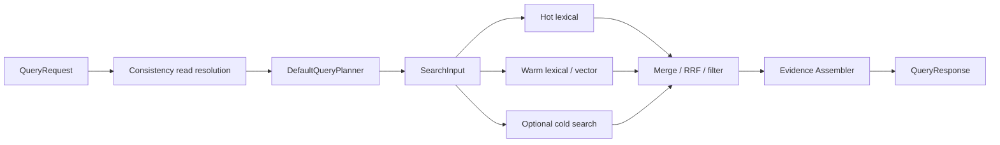

# 06. Retrieval, Query, and Evidence Assembly

> Language: [中文](../06-retrieval-query-and-evidence.md) | English

---

This chapter explains the dual-plane data model, candidate retrieval and ranking, canonical hydration, graph expansion, version resolution, provenance, and proof traces.

---

## 06.1. Canonical State vs Retrieval Projection

### 06.1.1. Positioning

| Attribute | Definition |
|---|---|
| Type | Data Perspective |
| Question | How are authoritative canonical state and disposable retrieval projections separated, connected, and recovered? |
| Maturity | The basic dual-plane design is implemented; automatic divergence reconciliation is Partial. |

### 06.1.2. Code Entry Points

| Direction / concern | Package / file | Interface / method |
|---|---|---|
| canonical contracts | `src/internal/storage/contracts.go` | `ObjectStore`, `GraphEdgeStore`, `SnapshotVersionStore`, `RuntimeStorage` |
| canonical commit | `src/internal/storage/canonical_projection.go`, Badger stores | `ApplyCanonicalProjection` |
| event derivation | `src/internal/materialization/service.go` | `MaterializeEvent` |
| projection write/read | `src/internal/dataplane/contracts.go` | `DataPlane.Ingest`, `Search`, `Flush` |
| vector projection | `src/internal/dataplane/vectorstore.go` | `AddText(s)`, `AddVector`, `Build`, `Search` |
| tier connection | `src/internal/storage/tiered.go`, `src/internal/dataplane/tiered_adapter.go` | tier read/write and `IncludeCold` search |
| rebuild | `src/internal/worker/runtime.go`, access admin handlers, index workers | `ReindexEmbeddings`, prebuild and replay methods |

### 06.1.3. Inputs and Outputs

| Flow | Input | Output | Connection key |
|---|---|---|---|
| canonical mutation | canonical object/edge/version bundle | persisted object graph | object ID + version |
| projection mutation | `IngestRecord` | lexical/vector/sparse/native record | `ObjectID` |
| query projection | `SearchInput` | candidate object IDs and scores | `ObjectID` |
| hydration | candidate IDs + requested types | canonical GraphNode/object/version/policy | typed object ID |
| rebuild | canonical Memory list or WAL entries | regenerated projection/index | object ID + embedding family/dim |
| delete/archive | object ID + mode | tombstone/eviction/cold movement | same object ID across tiers |

### 06.1.4. Internal Components

| Canonical plane | Projection plane |
|---|---|
| Event/WAL, Memory, State, Artifact | lexical records, vector/sparse records |
| Edge, ObjectVersion | hot/warm/cold segment metadata |
| PolicyRecord, ShareContract, Audit | native index handles and candidate views |
| MemoryAlgorithmState | evidence fragment cache |

Object ID is the primary join key. Namespace, object and memory type, event time, and embedding family/dimension are compatibility and filtering metadata.

Transformation and hydration:

| Direction | Function/path |
|---|---|
| Event -> both planes | `MaterializeEvent` produces Memory + `IngestRecord` |
| canonical -> projection rebuild | `Runtime.ReindexEmbeddings`, warm prebuild/index workers |
| projection -> canonical | candidate IDs -> ObjectStore/Edge/Version lookups |
| cold -> response | explicit `include_cold`, then merge/filter/evidence |

### 06.1.5. Call Relationships

Event writes are driven by the consistency projection callback, which invokes the materializer, DataPlane, and canonical store. Queries read the retrieval projection first, hydrate from canonical stores, and build evidence. Admin replay and reindex operations reconstruct projections from the WAL or canonical state.

The active write path calls `DataPlane.Ingest` before `ApplyCanonicalProjection`; they do not share a transaction. Canonical materialization of keyed State is performed primarily by the subscriber worker, so visible Memory projection does not imply that State materialization has completed.

### 06.1.6. Data and State

Projection records contain lexical, vector, and sparse features plus attributes and segment/tier/index metadata. They should not duplicate complete policy, provenance, and version state. Canonical persistence does not guarantee that every object has entered an ANN index.

| Plane | Persistent state | In-memory state |
|---|---|---|
| canonical | Badger objects/edges/versions/policies/audit/algorithm state | memory backend equivalents |
| projection | Selected native and cold-vector state | lexical postings, buffers, hot cache |
| connection metadata | object ID, embedding family/dim, generation/segment refs | query trace/cache entries |

### 06.1.7. Correctness

- Retrieval projection succeeds before canonical commit in the active write callback; the two operations do not share a cross-engine transaction.
- Normal queries filter inactive Warm Memory, while an explicit Cold query may return archived object IDs.
- Delete/purge canonical, segment/index, cache, and cold records separately.
- Archive/export should verify the Cold write before deleting Warm data; this rule is implemented by individual operation paths rather than one invariant manager.

#### 06.1.7.1. Recovery model

Canonical state is the recovery basis for current object facts, while WAL is the basis for replaying causal order. Retrieval projections can be reconstructed by replay or reindex. There is no continuous divergence scanner or cross-plane checksum checkpoint, so rebuild capability is not equivalent to automatic drift detection and repair.

### 06.1.8. Claim Boundaries

Supported claim: Plasmod separates authoritative canonical state from disposable retrieval projections.

Do not claim that projections are always synchronous with canonical state, that both planes share one ACID transaction, or that every projection hit has complete canonical and evidence data.

### 06.1.9. Gaps

- no projection generation/checkpoint or per-object projection status;
- no continuous stale/divergence scanner and checksum;
- no unified tombstone propagation for deletion, archive, and reactivation;
- incomplete canonical-driven repair after failures;
- missing dual-plane fault-injection, rebuild-equivalence, and stale-read contract tests.

---

## 06.2. Evidence Construction Pipeline

### 06.2.1. Positioning

| Attribute | Definition |
|---|---|
| Type | Pipeline Perspective |
| Question | How to retrieve a hit into an explanatory, traceable response |
| Maturity | The base pipeline is implemented; completeness/confidence scoring and stronger governance remain Partial. |

### 06.2.2. Code Entry Points

| Concern | Package / file | Constructor / method |
|---|---|---|
| query entry | `src/internal/access/gateway.go`, `src/internal/worker/runtime.go` | query handler, `Runtime.ExecuteQuery` |
| query plan | `src/internal/semantic/` | `NewDefaultQueryPlanner`, `QueryPlanner.Build` |
| retrieval | `src/internal/dataplane/` | `DataPlane.Search` |
| evidence skeleton | `src/internal/evidence/assembler.go` | `NewAssembler`/`NewCachedAssembler`, `Build` |
| graph/proof completion | `src/internal/worker/chain/chain.go` | `QueryChain.Execute` |
| graph worker | `src/internal/worker/indexing/subgraph.go` | `Expand` |
| proof worker | `src/internal/worker/coordination/` | proof trace constructor/dispatch |

### 06.2.3. Inputs and Outputs

| Stage | Typed input | Output |
|---|---|---|
| planning | `schemas.QueryRequest` | `schemas.QueryPlan` |
| candidate search | `dataplane.SearchInput` | `dataplane.SearchOutput` |
| assembly | candidate IDs + query context | nodes, incident edges, latest versions, provenance, policy annotations |
| graph expansion | `GraphExpandRequest` + hydrated nodes/edges | `GraphExpandResponse` |
| proof | seeds + subgraph | `[]ProofStep` |
| packaging | retrieval/evidence/consistency metadata | `schemas.QueryResponse` |

### 06.2.4. Internal Components

#### 06.2.4.1. Stage to function map

| Stage | Function/component | Output |
|---|---|---|
| Candidate retrieval | `DataPlane.Search` | object IDs/tier/segment trace |
| Type/memory filter | Runtime + `Assembler.filterByObjectTypes` | filtered IDs |
| Object hydration | Runtime/QueryChain ObjectStore lookups | GraphNode/type/provenance data |
| Graph expansion | `GraphEdgeStore.BulkEdges`, Subgraph worker | typed Edge/subgraph |
| Version resolution | `Assembler.resolveVersions` | latest ObjectVersion |
| Provenance integration | `resolveProvenance`, embedding attachment, derivation worker | event/ref strings |
| Policy annotation | policy filters + `governanceAnnotations` | applied filters/proof steps |
| Proof construction | assembler skeleton/cache + ProofTraceWorker BFS | ProofStep list |
| Packaging | `QueryResponse` | evidence-bearing response |

#### 06.2.4.2. Evidence schema

| Record | Key fields |
|---|---|
| GraphNode | object ID/type/label/properties |
| Edge | source/type/relation/destination/weight/provenance/time |
| ObjectVersion | object/version/mutation event/valid interval/tag |
| ProofStep | step/depth/source/edge/target/weight/operation/description |
| EvidenceSubgraph | seeds/nodes/edges/proof/provenance |

#### 06.2.4.3. Cache behavior

During ingest, `PreComputeService` may place an EvidenceFragment in a bounded in-memory cache. Queries merge cached fragments and, on a miss, read Edge, Version, and Policy stores to construct the missing evidence. The cache is not durable and has no unified generation-based invalidation after version changes, so correctness must depend on canonical lookups rather than cache-only answers.

### 06.2.5. Call Relationships

Gateway decodes QueryRequest. Runtime applies the consistency read gate and builds a plan. NodeManager and DataPlane obtain candidates; Runtime performs type, scope, and state filtering plus canonical supplementation. The Assembler hydrates canonical data, QueryChain expands the subgraph and builds proof steps, and visibility middleware removes debug and chain fields when required.

`/v1/query/batch` is a direct warm-vector batch path, not a batch form of the complete Query & Evidence Chain. It accepts `VectorWarmBatchQueryRequest`, not an array of `QueryRequest` values.

### 06.2.6. Data and State

- Input projection state: candidate IDs, score, tier/segment/index trace;
- canonical state: Memory/State/Artifact/Event, Edge, ObjectVersion, PolicyRecord;
- provenance state: source Event/ref, derivation log, embedding annotation;
- In-memory state: bounded evidence fragment cache and query-local hydrated graph;
- Output state: `QueryResponse` contains objects, subgraph, proof, retrieval metadata, and consistency metadata. A query normally does not mutate canonical state.

Graph/version/provenance rules:

- Assembler reads incident edges for returned IDs. QueryChain defaults to a one-hop subgraph, while the proof worker has an internal maximum of eight hops.
- Version resolution currently selects the latest version. A query time window is not equivalent to historical version resolution.
- Provenance is assembled from Edge references, version mutation Events, Memory/State/Artifact source fields, and embedding annotations.
- Supporting, contradicting, and derived relations can be represented by EdgeType, but there is no uniform evidence-rank or confidence formula.

### 06.2.7. Correctness

Cache miss still reads canonical stores; therefore cache is optimization rather than authority. The current version resolver selects the latest, without providing a query-time historical snapshot; graph expansion and proof have hop/node/edge caps.

Policy and proof boundary:

Policy annotation states the status of an object; it does not always require the removal of an object. Proof trace is an explanatory execution/relationship trajectory, not a formally verifiable proof.

### 06.2.8. Claim Boundaries

Supported claim: Plasmod assembles structured node, edge, version, provenance, and proof packages, with optional cache assistance.

Do not claim complete evidence, formally verified or replayable proofs, uniformly enforced policy annotations, or statistically calibrated confidence/support scores.

### 06.2.9. Gaps

- no version-aware cache generation or invalidation;
- no historical or valid-at version resolver;
- `schemas.GraphExpander` has no active implementation; the active `SubgraphExecutorWorker.Expand` uses a different multi-argument contract;
- no unified evidence ranker or completeness/confidence definition;
- no policy-safe graph traversal with uniform edge-level visibility enforcement;
- no complete pipeline-replay or stale-cache contract tests.

---

## 06.3. Dual-plane Data Mechanism

### 06.3.1. Positioning

| Attribute | Definition |
|---|---|
| Type | Mechanism |
| Goals | Canonical truth is separated from disposable retrieval acceleration |
| Critical-path role | ingest/query/recovery |
| Maturity | The core mechanism is Implemented; continuous reconciliation is Partial. |

### 06.3.2. Code entry

`materialization.MaterializationResult` contains canonical records and can be converted to `dataplane.IngestRecord`. Runtime sends these representations to RuntimeStorage and DataPlane respectively. Query uses candidate IDs to join retrieval results with canonical stores and evidence.

### 06.3.3. Input/output

| Transform | Input | Output |
|---|---|---|
| canonicalization | Event | Memory, State, Artifact, Edge, ObjectVersion, and derivation metadata |
| projection | Event/Memory text+embedding+metadata | IngestRecord/segments/index |
| hydration | candidate IDs | object-derived nodes/edges/versions/provenance |
| rebuild | canonical Memory scan | fresh retrieval plane |

### 06.3.4. Internal components

Canonical components are WAL, RuntimeStorage, and Badger/in-memory stores. Projection components are the hot index, SegmentDataPlane, vector and sparse stores, native bridge, cold index, and evidence cache.

### 06.3.5. Call relation

Ingest writes projection before canonical commit; query reads projection then canonical; admin reindex resets/re-ingests; delete/purge/archive coordinate multiple components manually.

### 06.3.6. State and synchronization

Object ID is the join key; embedding family plus dimension is the compatibility key. `flushDirty` and periodic flush maintain the warm native index. The checkpoint tracks LSN visibility, but not a complete per-object projection generation.

### 06.3.7. Correctness

The canonical store is authoritative and projections may be discarded and rebuilt. A successful DataPlane write followed by a failed canonical commit can produce an orphan candidate; a canonical-only mutation can produce a missing candidate. Current repair uses replay, reindexing, or manual purge rather than an automatic scanner.

### 06.3.8. Claim Boundaries

Supported claim: Plasmod implements a dual-plane architecture with rebuildable retrieval projections.

Do not claim instantaneous plane equality, cross-plane ACID, automatic stale detection, or lossless delete propagation.

### 06.3.9. Gaps

Add projection generation/object status, canonical commit token, tombstone propagation, checksum/divergence scan, repair plan and post-repair query verification.

---

## 06.4. Evidence Construction Mechanism

### 06.4.1. Positioning

| Attribute | Definition |
|---|---|
| Type | Mechanism |
| Goals | Candidate -> canonical object -> graph/version/provenance/policy -> proof package |
| Maturity | Base assembly is Implemented; ranking and completeness scoring are Partial. |

### 06.4.2. Code entry and APIs

`Assembler.Build`, `QueryChain.Run`, ProofTraceWorker, SubgraphExecutorWorker, `GET /v1/traces/{id}`, `POST /v1/query`.

### 06.4.3. Input/output

Inputs are `SearchInput`, `SearchOutput`, policy-filter descriptions, and canonical stores. Outputs populate `QueryResponse` with object IDs, nodes, edges, versions, provenance, proof steps, cache metadata, and retrieval metadata.

### 06.4.4. Internal components

| Component | Function |
|---|---|
| fragment cache/precompute | amortize ingest-time evidence metadata |
| object hydrator logic | infer/load Memory/Event/Artifact/State data |
| edge expander | incident edges and one-hop subgraph |
| proof worker | BFS edge + derivation trace |
| version resolver | latest version |
| provenance resolver | source events/edge refs/mutation events |
| policy annotator | quarantine/retracted/filter proof steps |

### 06.4.5. Relations and version behavior

EdgeType represents derived, support, conflict, and share relationships. Proof construction uses stored edges rather than inferring missing ones. The current assembler resolves only the latest version; a historical time window does not select an exact historical snapshot.

### 06.4.6. Cache/state

The evidence cache is bounded, in-memory, and disposable. Canonical evidence inputs live in Edge, Version, Policy, and derivation stores. Cache hits and misses appear in response statistics.

### 06.4.7. Correctness

- Duplicate edges are merged by EdgeID in QueryChain.
- Annotation is not always enforcement.
- Unknown ID type inference can default to memory.
- No formula for evidence completeness/confidence/support score.
- Proof trace can mix execution descriptions and graph derivation steps.

### 06.4.8. Claim Boundaries

Supported claim: Plasmod assembles structured, traceable evidence from canonical records.

Do not claim formal proofs, complete provenance, calibrated confidence, or version-time correctness for arbitrary historical queries.

### 06.4.9. Gaps

Need typed evidence node contract, policy-safe traversal, historical version resolver, cache generation/invalidation, rank/confidence/completeness definition and replay verifier.

---

## 06.5. Adaptive Retrieval Engine

### 06.5.1. Positioning

| Attribute | Definition |
|---|---|
| Type | Engine |
| Original Module | Retrieval Dataplane |
| Goals | QueryPlan -> tiered/hybrid candidates with physical index acceleration |
| Critical-path role | Yes |
| Maturity | Basic tiered and hybrid retrieval is Implemented; intent and cost adaptation are Partial. |

### 06.5.2. Code entry

| Item | Code |
|---|---|
| Go API | `src/internal/dataplane/contracts.go` |
| Active adapter | `tiered_adapter.go: TieredDataPlane` |
| Warm plane | `segment_adapter.go: SegmentDataPlane` |
| Logical index | `segmentstore/` |
| Vector/sparse | `vectorstore.go`, `sparsestore.go` |
| Native bridge | `dataplane/retrievalplane/bridge.go`, `cpp/retrieval` |
| Planner | `semantic.DefaultQueryPlanner` |
| Constructor | `NewTieredDataPlaneWithEmbedderAndConfig` |

### 06.5.3. Engine fields

| `TieredDataPlane` field | Meaning |
|---|---|
| `hot *segmentstore.Index` | fast in-memory lexical tier |
| `warm *SegmentDataPlane` | lexical/vector/sparse warm execution |
| `warmIngest func` | injectable/testable warm write path |
| `embedder` | configured embedding generator |
| cold lexical/vector/HNSW function fields | TieredObjectStore adapters |
| `rrfK` | fusion constant |

Warm plane internally owns segment index/planner/searcher/vector/sparse stores, embedder and registered warm segment mappings.

### 06.5.4. Interface and method surface

| Interface/API | Methods |
|---|---|
| `DataPlane` | `Ingest`, `Search`, `Flush` |
| Tiered extension | `BatchIngest`, reset/rebuild, hot/warm accessors |
| Warm segment | vector/flat ingest with index type, register/unload, text/vector search |
| Batch | plugin/raw/serial batch search and object-ID mapping |
| Native | index create/insert/search/release through bridge |

See HTTP/transport mapping [API to Engine Matrix](14-implementation-status-gaps-and-claim-boundaries.md).

### 06.5.5. Input/output

| Input | Fields used | Output |
|---|---|---|
| `IngestRecord` | ID/text/namespace/time/attributes/embedding/skip flag/family/dim | index/segment mutation |
| `SearchInput` | text/vector/TopK/namespace/time/types/cold | `SearchOutput` candidates/tier/trace/diagnostics |
| Warm batch | segment, NQ, TopK, flat vectors | IDs/distances/object ID rows |

### 06.5.6. Retrieval strategy

Warm can merge lexical and vector/sparse candidates via RRF/normalization. Precomputed query/event vectors bypass embedder.

The current model provides tier fallback, candidate fusion, optional Cold/native retrieval, and early Hot satisfaction. It does not include a general intent estimator, cost model, or learned router.

### 06.5.7. Correctness and failure

- embedding family and dimension are compatibility boundaries; matching dimensions alone are insufficient.
- `Search` returns value not error; backend failure classification is weak.
- object/memory type filters partly post-retrieval.
- native candidate does not carry canonical policy/evidence semantics.
- Hot/Warm updates occur through TieredDataPlane; Cold archival is a separate operation.

### 06.5.8. Claim Boundaries

Supported claim: hybrid and tiered retrieval, optional native ANN, precomputed embeddings, RRF-style fusion, and a direct batch-segment API are implemented.

Do not claim learned adaptive routing, universal backend availability, equivalence between an ANN result and the final agent-visible answer, or execution of every advanced query-plan descriptor.

### 06.5.9. Gaps

Typed search error/partial result, score/reason metadata per candidate, policy-aware prefilter, intent/cost router, segment health/load feedback, cross-backend ranking contract and projection generation validation.

---

## 06.6. Evidence Assembly Engine

### 06.6.1. Positioning

| Attribute | Definition |
|---|---|
| Type | Engine |
| Original Module | Evidence Assembler |
| Goals | Candidate IDs + query context -> structured evidence response |
| Critical-path role | structured `/v1/query` |
| Maturity | Base evidence assembly is Implemented; ranking, completeness, and historical versioning are Partial. |

### 06.6.2. Code entry

| Item | Code |
|---|---|
| Package | `src/internal/evidence` |
| Main files | `assembler.go`, `cache.go`, `fragment.go` |
| Constructors | `NewAssembler`, `NewCachedAssembler` |
| Wiring | `WithEdgeStore`, `WithVersionStore`, `WithObjectStore`, `WithPolicyStore` |
| Main method | `Build(SearchInput, SearchOutput, filters)` |
| Post assembly | `worker/chain.QueryChain`, Runtime embedding provenance |

### 06.6.3. Engine fields

| Field | Type | Purpose |
|---|---|---|
| `cache` | `*evidence.Cache` | ingest precomputed fragment lookup |
| `edgeStore` | `GraphEdgeStore` | one-hop incident edges |
| `versionStore` | `SnapshotVersionStore` | latest versions |
| `objectStore` | `ObjectStore` | type/memory subtype and source hydration |
| `policyStore` | `PolicyStore` | quarantine/retracted annotations |

### 06.6.4. Input/output fields

| Input | Used for |
|---|---|
| SearchInput object/memory types | post-filter |
| SearchOutput IDs/tier/cold/segments | response objects, proof steps, diagnostics |
| filters | `AppliedFilters` |
| stores/cache | edges/versions/provenance/policy/cache proof |

Output `QueryResponse` fields are enumerated in [Object and Message Registry](14-implementation-status-gaps-and-claim-boundaries.md).

### 06.6.5. Internal components

| Suggested component | Actual function/status |
|---|---|
| Object Hydrator | Prefix inference + store lookup, part |
| Graph Builder | `expandEdges` + QueryChain, full base |
| Version Resolver | latest-only `resolveVersions` |
| Provenance Resolver | `resolveProvenance` + Runtime attachment |
| Policy Annotator | `governanceAnnotations`, annotation only |
| Proof Constructor | planner/retrieval/policy/response steps + fragments |
| Evidence Ranker | no independent ranker |
| Evidence Cache | bounded in-memory cache |
| Response Packager | QueryResponse construction |

### 06.6.6. Calls, sync and state

Runtime calls the Assembler after retrieval and filtering; QueryChain then augments nodes, edges, and proof steps. These operations are synchronous. The cache is mutable and in-memory, while the Assembler has fixed dependencies and no per-request state.

### 06.6.7. Correctness/failure

- A missing optional store yields an empty corresponding section rather than an error.
- Unknown ID defaults to memory type heuristic.
- Policy violation is annotated, not necessarily filtered.
- Latest version selection ignores historical query time.
- Cache miss is tolerated; cache staleness has no generation invalidation.

### 06.6.8. Claim Boundaries

Supported claim: Plasmod assembles object IDs, edges, latest versions, provenance, and proof traces from canonical records.

Do not claim complete payload hydration, formal proof, calibrated evidence scores, complete ACL enforcement, or historical-version correctness.

### 06.6.9. Gaps

Remaining gaps include an explicit `EvidencePackage` schema, a typed hydrator, a version-at-time resolver, policy-decision enforcement, cache invalidation, rank/support/confidence/completeness algorithms, and a strict missing-dependency error mode.

---

## 06.7. Query Path Design

### 06.7.1. Request Parsing

`QueryRequest` supports query text, scope, agent/session/tenant/workspace filters, top K, time windows, object/memory/edge types, target IDs, dataset/source/batch selectors, access/materialization/runtime selectors, query operations, warm-segment selection, cold-tier inclusion, and precomputed embeddings.

### 06.7.2. Visibility Wait

`ExecuteQueryContext` calls the consistency Controller in read mode. Strict and bounded modes may wait for the required watermark; eventual mode does not promise immediate visibility of the latest entry.

### 06.7.3. Exact-selector Fast Path

`target_object_ids` and structured selectors such as state/latest can supplement retrieval or read directly from canonical storage, avoiding a purely semantic search. `query_status` distinguishes retrieval seeds from canonical supplementation.

### 06.7.4. Tiered retrieval

The hot index performs lexical search first. If it does not fill top K, the query reaches the warm plane, which can combine lexical, dense, and sparse candidates. `include_cold=true` also searches the cold store. The response records tier, mode, candidate counts, and fallback behavior.

### 06.7.5. Evidence assembly

The assembler filters IDs by object/memory type, combines evidence cache, reads incident edges with versions, adds policy/tier/segment/proof steps, and generates provenance.

### 06.7.6. Return Boundary

The default response contains structured evidence. `objects_only` reduces the response shape; it does not change the source of truth. With `APP_MODE=prod`, debug, raw, and chain-trace fields are removed, so callers must not depend on test-mode debug payloads.
